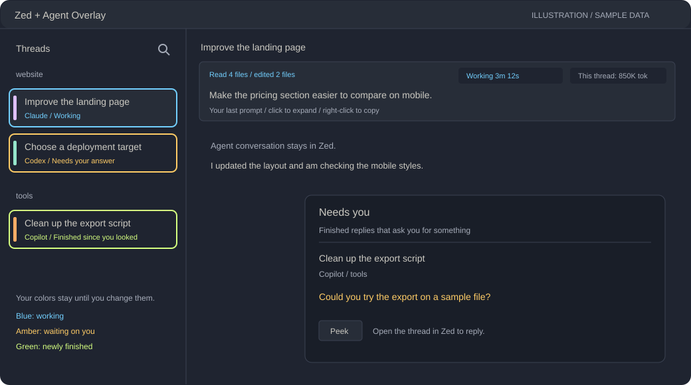

# Zed Agent Overlay

A small Windows overlay for [Zed](https://zed.dev)'s Agent Panel, made for people who **direct and review** AI agents rather than type code.

I run Claude Code, Codex and GitHub Copilot side by side in Zed every day. Zed is the best place I have found to do that, but the reviewer's seat was missing a few things: finding my own last prompt, seeing *what* an agent is doing without reading every command, knowing which thread needs me, and searching across threads. I wrote those up in [an operator's view of the Agent Panel](https://github.com/zed-industries/zed/discussions/64782). This overlay is my workaround until Zed has them built in.

It sits on top of Zed's window, follows it around, and never changes anything in Zed or in your agents' files.

It works across projects and applications in Zed. Status and helper tracking use each thread's agent session, not its project or application name. Agent-format limitations apply equally to every project.

*Illustrative preview with made-up threads and usage numbers, not a screenshot.*

## What it adds

**In the threads sidebar**
- **Color bar beside every thread.** Click it to tag the thread with one of 9 colors (from Zed's Ayu Mirage theme), right-click to clear. Colors only change when you change them.
- **Status ring around each thread.** Blue (gently pulsing) while the agent works, amber (pulsing) while it waits on your answer, green when it finishes. Green stays until you view the thread; if you're already viewing it, green appears briefly for five seconds.
- **Helper-agent dashes beneath the ring.** One blue dash per active helper, capped at six dashes with a **+** for more. The hover card and open-thread status show the exact count, distinguishing "Working with 3 helper agents" from "Waiting for 3 helper agents." Background commands and finished helpers are not counted.
- **Hover card.** Rest the mouse on a thread to see its status, what it did this turn, your last prompt and its token use, without opening it.

**At the top of the open thread**
- **Last-prompt bar.** Your most recent prompt, always visible. Click to expand, right-click to copy.
- **Previous / next / bottom buttons** that step through your prompts in the thread. The bar shows which prompt you are on ("11 of 12").
- **What the agent is doing, in plain words.** "Working 3m 12s · Editing App.jsx", and a turn summary like "Read 4 files · ran 3 commands · edited 2 files (a.ps1, b.md)". Claude and Copilot describe each command in one line; that line is shown instead of the command.
- **Usage chip.** Codex's weekly limit % and reset time, Claude's token counts, Copilot's premium requests. Click it for a summary of all three.
- **GitHub card.** The newest GitHub Actions run for the repo(s) in the thread's folders: a progress bar while it runs, then passed or failed. Click to open the run.

**Windows you can open**
- **Search threads** (magnifier button, tray menu, or `Ctrl+Alt+Shift+F`): search your prompts and the agents' replies across every thread, including archived ones.
- **Needs you** (bell button, tray menu, or `Ctrl+Alt+Shift+N`): finished threads whose reply asks you for something, with just those sentences pulled out ("Please check on …", "Should I …?"). Questions an agent asks through its own question box are left out, because Zed already shows those with buttons.
- **Peek** (Ctrl+click a thread's color bar): keep another thread's latest reply, status and timer open next to your work.
- **Notifications** when a thread asks you something or finishes while you are looking elsewhere.

## Requirements

- Windows 10 or 11 with Windows PowerShell 5.1 (built in).
- Zed with the Threads Sidebar on the **left**.
- One or more of: Claude Code (`claude-acp`), Codex (`codex-acp`), GitHub Copilot CLI (`github-copilot-cli`) in Zed's Agent Panel.
- Windows' built-in text recognition, which comes with your Windows display language (English works).
- Optional: the [GitHub CLI](https://cli.github.com/) (`gh`), signed in, for the GitHub card.

## Install

1. Download `ZedThreadColors.ps1` and `Start Zed Thread Colors.cmd` into the same folder.
2. Double-click **Start Zed Thread Colors**. A four-color icon appears in the system tray.
3. Bring Zed to the front. The bars appear beside your threads within a few seconds.

**Start with Windows is off by default.** Enable it from the tray menu if you want the overlay to start when you sign in. Updating an existing installation keeps your current startup setting. To update: tray icon > **Quit**, replace the files, start it again.

## How it works

- **Finding threads on screen.** Zed doesn't tell Windows where its sidebar rows are, so the overlay reads the sidebar with Windows' built-in text recognition (OCR) and lines up with the thread names. Recognition runs on a separate, low-priority worker, with one capture at a time so animated icons cannot prevent results from appearing. Results are discarded if Zed moves, resizes, minimizes, or loses focus while recognition runs. It matches names to a background-loaded copy of Zed's local thread database (read-only).
- **Reading the agents.** Each agent keeps its conversation in local files (`~/.claude/projects`, `~/.codex/sessions`, `~/.copilot/session-state`). Search and usage read only the new part each time. The last-prompt reader checks a bounded portion of changed files. All history reading runs on a low-priority background thread, not on the interface thread.
- **Claude background work.** Background jobs are tracked by task ID, including completions delivered as queued messages and helpers restarted through `SendMessage`. Duplicate notifications do not double-count a job or turn a finished thread blue again. A quiet background job is not assumed finished: after 30 minutes without recorded activity, the status says "No activity" and the working ring clears rather than turning green.
- **Nothing leaves your PC**, except the GitHub card's calls to GitHub through your own signed-in `gh` tool.
- The prompt jump buttons press Zed's own default keys (`Ctrl+Alt+Shift+PageUp/PageDown`, `Ctrl+Alt+End`).
- It keeps its own files in `%LOCALAPPDATA%\ZedThreadColors` (your colors, which threads you've seen, a log).

## Limits

- **Windows only.** It uses Windows APIs throughout.
- **Screen reading isn't perfect.** It tolerates small misreads, but an unusual sidebar layout or font size can confuse it. The log (tray > Open log) says what it saw.
- **Colors are Zed's Ayu Mirage theme**, hard-coded in the `Theme` class near the top of the script. Change them there to match another theme.
- **"Needs you" uses word patterns** to find asks in a reply. It can miss one or include a sentence that isn't one.
- **No plan limits for Claude or Copilot.** Their files don't record them, so only Codex shows a percentage.
- **Helper counts depend on the agent.** Claude tracks foreground, background, and restarted helpers. Copilot tracks directly called foreground and background helpers; a background helper stays counted after its launch call returns, until its recorded `subagent.completed` event. Codex helper counts aren't tracked yet.
- **It follows these agents' file formats as of October 2026.** Missing or unreadable histories are identified in the prompt bar and search status, with details in the log (tray > **Open log**). The open thread's history is retried on every background pass (about 1.5 seconds), so a newly created session can acquire its working ring as soon as its history appears. Other missing histories are checked again after 30 seconds. A changed format can still leave usage at `--` or produce no recognized messages; that does not mean the agent has no activity.

## Built with

Written with Claude Code (Anthropic) and directed by a non-developer, which is rather the point. Issues and ideas are welcome.

For development, run `powershell.exe -NoProfile -STA -File .\tests\Regression.Tests.ps1`. The checks use temporary sample histories and a generated image, without launching the overlay or changing your startup setting.

## License

MIT. See [LICENSE](LICENSE).
